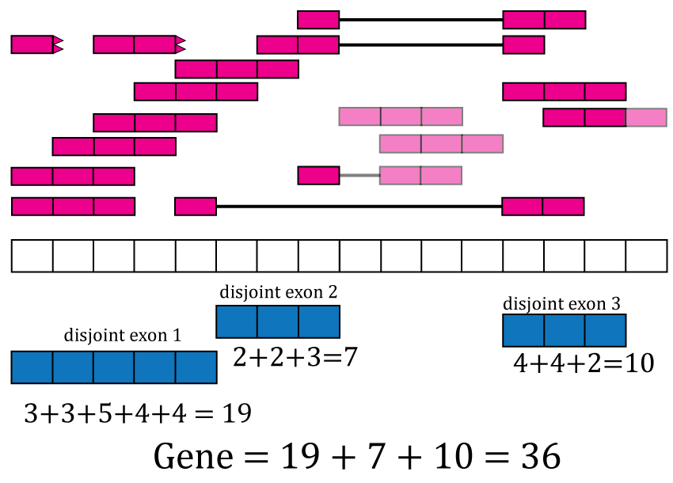

# Introduction

RNA sequencing (RNA-seq) is now the most widely used high-throughput assays for measuring gene expression. In a typical RNA-seq experiment, several million reads are sequenced per sample. The reads are often aligned to the reference genome using a splice-aware aligner to identify where reads originated. Resulting alignment files are then used to compute count matrices which are used for several analyses such as identifying differentially expressed genes. The Bioconductor project [@huber2015] has many contributed packages that specialize in analyzing this type of data and previous workflows have explained how to use them [@Law2016a; @Love2016; @Chen2016]. Initial steps are typically focused on generating the count matrices. Some pre-computed matrices have been made available via the ReCount project [@frazee2011] or Bioconductor Experiment data packages such as the `airway` dataset [@airway]. The count matrices in ReCount have helped others access RNA-seq data avoid having to run the processing pipelines required to compute these matrices. However, in the years since ReCount was published, hundreds of new RNA-seq projects have been carried out and researchers have publicly shared the data publicly.

We recently uniformly processed over 70,000 publicly available human RNA-seq samples and made the data available via the recount2 resource at [jhubiostatistics.shinyapps.io/recount/](https://jhubiostatistics.shinyapps.io/recount/) [@collado-torres_reproducible_2017]. Samples in recount2 are grouped by project (over 2,000) originating from the Sequence Read Archive, the Genotype-Tissue Expression study (GTEx) and the Cancer Genome Atlas (TCGA). The processed data can be accessed via the `recount` Bioconductor package available at [bioconductor.org/packages/recount](http://bioconductor.org/packages/recount). Together, recount2 and the `recount` Bioconductor package should be considered a successor to ReCount.

Due to space constraints, the recount2 publication [@collado-torres_reproducible_2017] did not cover how to use the `recount` package and other useful information for carrying out analyses with recount2 data.  We describe how the count matrices in recount2 were generated. We also review the R code necessary for using the recount2 data, whose details are important because some of this code involves multiple Bioconductor packages and changing default options. We further show: a) how to augment metadata that comes with datasets with metadata learned from natural language processing of associated papers as well as expression data b) how to perform differential expression analyses, and c) how to visualize the base-pair data available from recount2.

## recount2 overview

The recount2 resource provides expression data summarized at different feature levels to enable novel cross-study analyses. Generally when investigators use the term _expression_, they think about gene expression. But more information can be extracted from RNA-seq data. Once RNA-seq reads have been aligned to the reference genome it is possible to determine the number of aligned reads overlapping each base-pair resulting in the genome base-pair coverage curve as shown in Figure \@ref(fig:Figure). In the example shown in Figure \@ref(fig:Figure1) most of the reads overlap known exons from a gene. Those reads can be used to compute a count matrix at the exon or gene feature levels. Some reads span exon-exon junctions (jx) and while most match the annotation, some do not (jx 3 and 4). An exon-exon junction count matrix can be used to identify differentially expressed junctions, which can show which isoforms are differentially expressed given sufficient coverage. For example, junctions 2 and 5 are unique to isoform 2, while junction 6 is unique to isoform 1. The genome base-pair coverage data can be used with `derfinder` [@collado-torres_flexible_2017] to identify expressed regions, some of them could be un-annotated exons and together with the exon-exon junction data uncover potential new isoforms.

```{r Figure1, out.width="100%", fig.align="center", fig.cap = "Overview of the data available in recount2. Reads (pink boxes) aligned to the reference genome can be used to compute a base-pair coverage curve and identify exon-exon junctions (split reads). Gene and exon count matrices are generated using annotation information providing the gene (green boxes) and exon (blue boxes) coordinates together with the base-level coverage curve. The reads spanning exon-exon junctions (jx) are used to compute a third count matrix that might include un-annotated junctions (jx 3 and 4). Without using annotation information, expressed regions (orange box) can be determined from the base-level coverage curve to then construct data-driven count matrices.", echo = FALSE}

```

recount2 provides gene, exon, and exon-exon junction count matrices both in text format and _RangedSummarizedExperiment_ objects (rse) [@summarizedexperiment] as shown in Figure \@ref(fig:Figure2). These rse objects provide information about the expression features (for example gene ids) and the samples. In this workflow we will explain how to add metadata to the rse objects in recount2 in order to ask biological questions. recount2 also provides coverage data in the form of BigWig files. All four features can be accessed with the `recount` Bioconductor package [@collado-torres_reproducible_2017]. `recount` also allows sending queries to `snaptron` [@Wilks2017] to search for specific exon-exon junctions.

```{r Figure2, out.width="100%", fig.align="center", fig.cap = "recount2 provides coverage count matrices in RangedSummarizedExperiment (rse) objects. Once the rse object has been downloaded and loaded into R, the feature information is accessed with rowRanges(rse) (blue box), the counts with assays(rse)\\$counts (pink box) and the sample metadata with colData(rse) (green box). The sample metadata can be expanded using add\\_predictions(rse) (orange box) or with custom code (brown box) matching by a unique sample identifier such as the SRA Run id. The rse object is inside the purple box and matching data is highlighted in each box.", echo = FALSE}

```

## Packages used in the workflow

In this workflow we will use several Bioconductor packages. To reproduce the entirety of this workflow, install the packages using the following code after installing R 3.4.x from CRAN in order to use Bioconductor version 3.5 or newer.

```{r "install", eval = FALSE}
## Install packages from Bioconductor
source("https://bioconductor.org/biocLite.R")
biocLite(c("recount", "GenomicRanges", "limma", "edgeR", "DESeq2",
    "regionReport", "clusterProfiler", "org.Hs.eg.db", "gplots", "derfinder",
    "rtracklayer", "GenomicFeatures", "bumphunter", "derfinderPlot",
    "devtools"))
```

Once installed, load all of the packages with the following code.

```{r "load libraries", message = FALSE, warning = FALSE}
library("recount")
library("GenomicRanges")
library("limma")
library("edgeR")
library("DESeq2")
library("regionReport")
library("clusterProfiler")
library("org.Hs.eg.db")
library("gplots")
library("derfinder")
library("rtracklayer")
library("GenomicFeatures")
library("bumphunter")
library("derfinderPlot")
library("devtools")
```

# Coverage counts provided by recount2

The most accessible features are the gene, exon and exon-exon junction count matrices. This section explains them in greater detail. Figure \@ref(fig:Figure3) shows 16 RNA-seq reads each 3 base-pairs long and a reference genome.

```{r Figure3, out.width="100%", fig.align="center", fig.cap = "RNA-seq starting data. 16 RNA-seq un-aligned RNA-seq reads 3 base-pairs long are shown (pink boxes) along a reference genome 16 base-pairs long (white box).", echo = FALSE}
knitr::include_graphics("Figure3.png")
```

Reads in the recount2 resource were aligned with Rail-RNA aligner [@rail-rna] which is splice-aware and can soft clip reads. Figure \@ref(fig:Figure4) shows the reads aligned to the reference genome. Some of the reads are split as they span an exon-exon junction. Two of the reads were soft clipped meaning that just a portion of the reads aligned (top left in purple). 

```{r Figure4, out.width="100%", fig.align="center", fig.cap = "Aligned RNA-seq reads. Spice-aware RNA-seq aligners such as Rail-RNA are able to find the coordinates to which the reads map, even if they span exon-exon junctions (connected boxes). Rail-RNA soft clips some reads (purple boxes with rough edges) such that a portion of these reads align to the reference genome.", echo = FALSE}
knitr::include_graphics("Figure4.png")
```

In order to compute the gene and exon count matrices we first have to process the annotation, which for recount2 is Gencode v25 (CHR regions) with hg38 coordinates. Although `recount` can generate count matrices for other annotations using hg38 coordinates. Figure \@ref(fig:Figure5) shows two isoforms for a gene composed of 3 different exons. 

```{r Figure5, out.width="100%", fig.align="center", fig.cap = "Gene annotation. A single gene with two isoforms composed by three distinct exons (blue boxes) is illustrated. Exons 1 and 3 share the first five base-pairs while exon 2 is common to both isoforms.", echo = FALSE}
knitr::include_graphics("Figure5.png")
```

The coverage curve is at the base-pair resolution, so if we are interested in gene counts we have to be careful not to double count base-pairs 1 through 5 that are shared by exons 1 and 3 (Figure \@ref(fig:Figure5)). Using the function `disjoin()` from `GenomicRanges` [@lawrence2013] we identified the distinct exonic sequences (disjoint exons). The following code defines the exon coordinates that match Figure \@ref(fig:Figure5) and the resulting disjoint exons for our example gene. The resulting disjoint exons are shown in Figure \@ref(fig:Figure6).

```{r "disjoin", message = FALSE}
library("GenomicRanges")
exons <- GRanges("seq", IRanges(start = c(1, 1, 13), end = c(5, 8, 15)))
exons
disjoin(exons)
```


```{r Figure6, out.width="100%", fig.align="center", fig.cap = "Disjoint exons. Windows of distinct exonic sequence for the example gene. Disjoint exons 1 and 2 form exon 1.", echo = FALSE}
knitr::include_graphics("Figure6.png")
```

Now that we have disjoint exons, we can compute the base-pair coverage for each of them as shown in Figure \@ref(fig:Figure7). That is, for each base-pair that corresponds to exonic sequence, we compute the number of reads overlapping that given base-pair. For example, the first base-pair is covered by 3 different reads and it does not matter whether the reads themselves were soft clipped. Not all reads or bases of a read contribute information to this step as some do not overlap known exonic sequence (light pink in Figure \@ref(fig:Figure7)).

```{r Figure7, out.width="100%", fig.align="center", fig.cap = "Base-pair coverage counting for exonic base-pairs. At each exonic base-pair we compute the number of reads overlapping that given base-pair. The first base (orange arrow) has 3 reads overlapping that base-pair. Base-pair 11 has a coverage of 3 but does not overlap known exonic sequence, so that information is not used for the gene and exon count matrices (grey arrow). If a read partially overlaps exonic sequence, only the portion that overlaps is used in the computation (see right most read).", echo = FALSE}

```

With base-pair coverage for the exonic sequences computed, the coverage count for each distinct exon is simply the sum of the base-pair coverage for each base in a given distinct exon. For example, the coverage count for disjoint exon 2 is $2 + 2 + 3 = 7$ as shown in Figure \@ref(fig:Figure8). The gene coverage count is then $\sum_i^n \texttt{coverage}_i$ where $n$ is the number of exonic base-pairs for the gene and is equal to the sum of the coverage counts for its disjoint exons as shown in Figure \@ref(fig:Figure8). 

```{r Figure8, out.width="100%", fig.align="center", fig.cap = "Exon and gene coverage counts. The coverage counts for each disjoint exon are the sum of the base-pair coverage. The gene coverage count is the sum of the disjoint exons coverage counts.", echo = FALSE}

```

For the exons, recount2 provides the disjoint exons coverage count matrix. It is possible to reconstruct the exon coverage count matrix by summing the coverage count for the disjoint exons that compose each exon. For example, the coverage count for exon 1 would be the sum of the coverage counts for disjoint exons 1 and 2, that is $19 + 7 = 26$. Some methods might assume that double counting of the shared base-pairs was performed while others assume or recommend the opposite.

## Scaling coverage counts

The coverage counts described previously are the ones actually included in the rse objects in recount2 instead of typical read count matrices. This is an important difference to keep in mind as most methods were developed for read count matrices. Part of the sample metadata available from recount2 includes the read length and number of mapped reads. Given a target library size (40 million reads by default), the coverage counts in recount2 can be scaled to read counts for a given library size as shown in Equation \@ref(eq:scale). Note that the resulting scaled read counts are not necessarily integers so it might be neccessary to round them if a differential expression method assumes integer data.

\begin{equation}
  \frac{\sum_i^n \text{coverage}_i }{\text{Read Length}} * \frac{\text{target}}{\text{mapped}} = \text{scaled read counts}
  (\#eq:scale)
\end{equation}

From Figure \@ref(fig:Figure4) we know that Rail-RNA soft clipped some reads, so a more precise measure than the denominator of Equation \@ref(eq:scale) is the area under coverage (AUC) which is the sum of the coverage for all base-pairs of the genome, regardless of the annotation as shown in Figure \@ref(fig:Figure9). Without soft clipping reads, the AUC would be equal to the number of reads mapped multiplied by the read length. So for our example gene, the scaled counts for a library size of 20 reads would be $\frac{36}{45} * 20 = 16$ and in general calculated with Equation \@ref(eq:scale2). The following code shows how to compute the AUC given a set of aligned reads and reproduce a portion of Figure \@ref(fig:Figure9).

\begin{equation}
  \frac{\sum_i^n \text{coverage}_i }{\text{AUC}} * \text{target} = \text{scaled read counts}
  (\#eq:scale2)
\end{equation}


```{r "coverage"}
## Take the example and translate it to R code
library("GenomicRanges")
reads <- GRanges("seq", IRanges(
    start = rep(
        c(1, 2, 3, 4, 5, 7, 8, 9, 10, 13, 14), 
        c(3, 1, 2, 1, 2, 1, 2, 1, 2, 4, 1)
    ), width = rep(
        c(1, 3, 2, 3, 1, 2, 1, 3, 2, 3, 2, 1, 3),
        c(1, 4, 1, 2, 1, 1, 2, 2, 1, 1, 2, 1, 1)
    )
))
## Get the base-level genome coverage curve
cov <- as.integer(coverage(reads)$seq)

## AUC
sum(cov)
```

```{r "coverage-reproduce", eval = FALSE}
## Code for reproducing the bottom portion of Figure 8.
pdf("base_pair_coverage.pdf", width = 20)
par(mar = c(5, 6, 4, 2) + 0.1)
plot(cov, type = "o", col = "violetred1", lwd = 10, ylim = c(0, 5),
     xlab = "Genome", ylab = "Coverage", cex.axis = 2, cex.lab = 3,
     bty = "n")
polygon(c(1, seq_len(length(cov)), length(cov)), c(0, cov, 0),
        border = NA, density = -1, col = "light blue")
points(seq_len(length(cov)), cov, col = "violetred1", type = "o",
       lwd = 10)
dev.off()
```

```{r Figure9, out.width="100%", fig.align="center", fig.cap = "Area under coverage (AUC). The area under coverage is the sum of the base-pair coverage for all positions in the genome regardless of the annotation. It is the area under the base-level coverage curve shown as the light blue area under the pink curve.", echo = FALSE}
knitr::include_graphics("Figure9.png")
```

The `recount` function `scale_counts()` computes the scaled read counts for a target library size of 40 million reads and we highly recommend using it before doing other analyses. The following code shows how to use `scale_counts()` and that the resulting read counts per sample can be lower than the target size (40 million). This happens when not all mapped reads overlap known exonic base-pairs of the genome. In our example, the gene has a scaled count of 16 reads for a library size of 20 reads, meaning that 4 reads did not overlap exonic sequences.

```{r "example_scaled", message = FALSE}
## Check that the number of reads is less than or equal to 40 million
## after scaling.
library("recount")
rse_scaled <- scale_counts(rse_gene_SRP009615, round = FALSE)
summary(colSums(assays(rse_scaled)$counts)) / 1e6
```

## Enriching the annotation

Data in recount2 can be used for annotation-agnostic analyses and enriching the known annotation. Just like exon and gene coverage count matrices, recount2 provides exon-exon junction count matrices. These matrices can be used to identify new isoforms (Figure \@ref(fig:Figure10)) or identify differentially expressed isoforms. For example, exon-exon junctions 2, 5 and 6 in Figure \@ref(fig:Figure1) are only present in one annotated isoform. `Snaptron` [@Wilks2017] allows programatic and high-level queries of the exon-exon junction information and it is graphical user interface is specially useful for visualizing this data. Inside R, the `recount` function `snaptron_query()` can be used for searching specific exon-exon junctions in recount2.

```{r Figure10, out.width="100%", fig.align="center", fig.cap = "Exon-exon junctions go beyond the annotation. Reads spanning exon-exon junctions are highlighted and compared against the annotation. Three of them match the annotated junctions, but one (blue and orange read) spans an un-annotated exon-exon junction with the left end matching the annotation and the right end hinting at a possible new isoform for this gene (blue and orange isoform).", echo = FALSE}

```

The base-pair coverage data from recount2 can be used together with `derfinder` [@collado-torres_flexible_2017] to identify expressed regions of the genome, providing another annotation-agnostic analysis of the expression data. Using the function `expressed_regions()` we can identify regions of expression based on a given data set in recount2. These regions might overlap known exons but can also provide information about intron retention events (Figure \@ref(fig:Figure11)), improve detection of exon boundaries (Figure \@ref(fig:Figure12)), and help identify new exons (Fig \@ref(fig:Figure1)) or expressed sequences in intergenic regions. Using `coverage_matrix()` we can compute a coverage matrix based on the expressed regions or another set of genomic intervals. The resulting matrix can then be used for a differential expression analysis, just like the exon, gene and exon-exon junction matrices.

```{r Figure11, out.width="100%", fig.align="center", fig.cap = "Intron retention events. Some reads might align with known intronic segments of the genome and provide information for exploring intron retention events (pink read). Some might support an intron retention event or a new isoform when coupled with exon-exon junction data (orange read).", echo = FALSE}
knitr::include_graphics("Figure11.png")
```

```{r Figure12, out.width="100%", fig.align="center", fig.cap = "Exon boundaries. Reads that go beyond the known exon boundaries can inform us of whether the annotated boundaries are correct or if there was a run-off transcription event.", echo = FALSE}
knitr::include_graphics("Figure12.png")
```


# Gene level analysis

Having reviewed how the coverage counts in recount2 were produced, we can now do a differential expression analysis. We will use data from 72 individuals spanning the human lifespan split into 6 age groups with SRA accession id SRP045638 [@jaffe2015]. The function `download_study()` requires a SRA accession id which can be found using `abstract_search()`. `download_study()` can then be used to download the gene coverage count data as well as other expression features. The files are saved in a directory named after the SRA accession id, in this case SRP045638.

```{r "download gene"}
library("recount")

## Find the project id by searching abstracts of studies
abstract_search("human brain development by age")

## Download the data if it is not there
if(!file.exists(file.path("SRP045638", "rse_gene.Rdata"))) {
    download_study("SRP045638", type = "rse-gene")
}

## Check that the file was downloaded
file.exists(file.path("SRP045638", "rse_gene.Rdata"))

## Load the data
load(file.path("SRP045638", "rse_gene.Rdata"))
```

The coverage count matrices are provided as _RangedSummarizedExperiment_ objects (rse) [@summarizedexperiment]. These objects store information at the feature level, the samples and the actual count matrix as shown in Figure 1 of Love et al., 2016 [@Love2016]. Figure \@ref(fig:Figure2) shows the actual rse objects provided by recount2 and how to access the different portions of the data. Using a unique sample id such as the SRA Run id it is possible to expand the sample metadata. This can be done using the predicted phenotype provided by `add_predictions()` [@Ellis2017], pulling information from GEO via `find_geo()` and `geo_characteristics()`, or with custom code.

## Metadata

Using the `colData()` function we can access sample metadata. More information on these metadata is provided in the supplementary material of the recount2 paper [@collado-torres_reproducible_2017], and we provide a brief review here. The rse objects for SRA data sets include 21 columns with mostly technical information. The GTEx and TCGA rse objects include additional metadata as available from the raw sources. In particular, we compiled metadata for GTEx using the v6 phenotype information available at [gtexportal.org](gtexportal.org), and we put together a large table of TCGA case and sample information by combining information accumulated across [Seven Bridges' Cancer Genomics Cloud](http://www.cancergenomicscloud.org/) and `TCGAbiolinks` [@TCGAbiolinks].

```{r colData}
## One row per sample, one column per phenotype variable
dim(colData(rse_gene))

## Mostly technical variables are included
colnames(colData(rse_gene))
```

### Technical variables

Several of these technical variables include the number of reads as reported by SRA, the actual number of reads Rail-RNA was able to download (which might be lower in some cases), the number of reads mapped by Rail-RNA, whether the sample is paired-end or not, the coverage AUC and the average read length (times 2 for paired-end samples). Note that sample with SRA Run id SRR2071341 has about 240.8 million reads as reported by SRA, while it has 120.4 million spots reported in https://trace.ncbi.nlm.nih.gov/Traces/sra/?run=SRR2071341; that is because it is a paired-end sample (2 reads per spot). These details are important for those interested on writing alternative scaling functions to `scale_counts()`.

```{r "explore colData"}
## Input reads: number reported by SRA might be larger than number
## of reads Rail-RNA downloaded
colData(rse_gene)[, c("read_count_as_reported_by_sra", "reads_downloaded")]
summary(colData(rse_gene)$proportion_of_reads_reported_by_sra_downloaded)

## AUC information used by scale_counts() by default
head(colData(rse_gene)$auc)

## Alternatively, scale_scounts() can use the number of mapped reads
## and other information
colData(rse_gene)[, c("mapped_read_count", "paired_end", "avg_read_length")]
```

### Biological information

Other metadata variables included provide more biological information, such as the [SHARQ beta](http://www.cs.cmu.edu/~ckingsf/sharq/) tissue and cell type predictions, which are based on processing the abstract of papers. This information is available for some of the SRA projects.

```{r sharq}
## SHARQ tissue predictions: not present for all studies
head(colData(rse_gene)$sharq_beta_tissue)
head(colData(rse_gene_SRP009615)$sharq_beta_tissue)
```

For some data sets we were able to find the GEO accession ids, which we then used to create the `title` and `characteristics` variables. If present, the `characteristics` information can be used to create additional metadata variables by parsing the `CharacterList` in which it is stored. Since the input is free text, sometimes more than one type of wording is used to describe the same information. Meaning that we might have to process that information in order to build a more convenient variable, such as a factor vector.

```{r characteristics}
## GEO information was absent for the SRP045638 data set
colData(rse_gene)[, c("geo_accession", "title", "characteristics")]

## GEO information for the SRP009615 data set
head(colData(rse_gene_SRP009615)$geo_accession)
head(colData(rse_gene_SRP009615)$title, 2)
head(colData(rse_gene_SRP009615)$characteristics, 2)

## Similar but not exactly the same wording used for two different samples
colData(rse_gene_SRP009615)$characteristics[[1]]
colData(rse_gene_SRP009615)$characteristics[[11]]

## Extract the target information
target <- sapply(colData(rse_gene_SRP009615)$characteristics, "[", 2)
target

## Build a useful factor vector, set the reference level and append the result 
## to the colData() slot
target_factor <- sapply(strsplit(target, "targeting "), "[", 2)
target_factor[is.na(target_factor)] <- "none"
target_factor <- factor(target_factor)
target_factor <- relevel(target_factor, "none")
target_factor
colData(rse_gene_SRP009615)$target_factor <- target_factor
```

As shown in Figure \@ref(fig:Figure2), we can expand the biological metadata information by adding predictions based on RNA-seq data [@Ellis2017]. The predictions include information about sex, sample source (cell line vs tissue), tissue and the sequencing strategy used. To add the predictions, simply use the function `add_predictions()` to expand the `colData()` slot.

```{r "add_predictions"}
## Before adding predictions
dim(colData(rse_gene))

## Add the predictions
rse_gene <- add_predictions(rse_gene)

## After adding the predictions
dim(colData(rse_gene))

## Explore the variables
colData(rse_gene)[, 22:ncol(colData(rse_gene))]
```


### Adding more information

Ultimately, more sample metadata information could be available elsewhere which can be useful for analyses. This information might be provided in the paper describing the data, the SRA Run Selector or other sources. As shown in Figure \@ref(fig:Figure2), it is possible to append information to the `colData()` slot as long as there is a unique sample identifier such as the SRA Run id.

For our example use case, project SRP045638 has a few extra biologically relevant variables via the SRA Run selector https://trace.ncbi.nlm.nih.gov/Traces/study/?acc=SRP045638. We can download that information into text file named `SRARunTable.txt` by default, then load it into R, sort it appropriately and then append it to the `colData()` slot. Below we do so for the SRP045638 project.

```{r "sra_run_table"}
## Save the information from 
## https://trace.ncbi.nlm.nih.gov/Traces/study/?acc=SRP045638
## to a table. We saved the file as SRP045638/SRARunTable.txt.
file.exists(file.path("SRP045638", "SRARunTable.txt"))

## Read the table
sra <- read.table(file.path("SRP045638", "SRARunTable.txt"),
    header = TRUE, sep = "\t")

## Explore it
head(sra)

## We will remove some trailing '_s' from the variable names
colnames(sra) <- gsub("_s$", "", colnames(sra))

## Choose some variables we want to add
sra_vars <- c("sex", "race", "RIN", "age", "isolate", "disease", "tissue")

## Re-organize the SRA table based on the SRA Run ids we have
sra <- sra[match(colData(rse_gene)$run, sra$Run), ]

## Double check the order
identical(colData(rse_gene)$run, as.character(sra$Run))

## Append the variables of interest
colData(rse_gene) <- cbind(colData(rse_gene), sra[, sra_vars])

## Final dimensions
dim(colData(rse_gene))

## Explore result
colData(rse_gene)[, 34:ncol(colData(rse_gene))]
```

Since we have the predicted sex as well as the reported sex via the SRA Run Selector, we can check whether they match.

```{r "sex preds"}
table("Predicted" = colData(rse_gene)$predicted_sex,
    "Observed" = colData(rse_gene)$sex)
```

## DE setup

Now that we have all the metadata available we can perform a differential expression analysis. The original study for project SRP045638 [@jaffe2015] looked at differences between 6 age groups: prenatal, infant, child, teen, adult and late life. The following code creates these six age groups.

```{r "age_groups"}
## Create the original 6 age groups
colData(rse_gene)$age_group <- factor(
    ifelse(colData(rse_gene)$age < 0, "prenatal",
    ifelse(colData(rse_gene)$age >= 0 & colData(rse_gene)$age < 1, "infant",
    ifelse(colData(rse_gene)$age >= 1 & colData(rse_gene)$age < 10, "child",
    ifelse(colData(rse_gene)$age>= 10 & colData(rse_gene)$age < 20, "teen",
    ifelse(colData(rse_gene)$age>= 20 & colData(rse_gene)$age < 50, "adult",
        "late life" ))))),
    levels = c("prenatal", "infant", "child", "teen", "adult", "late life")
)
```

Most of the differential expression signal from the original study was between the prenatal and postnatal samples. To simplify the analysis, we will focus on this comparison.

```{r "prenatal_factor"}
## Create prenatal factor
colData(rse_gene)$prenatal <- factor(
    ifelse(colData(rse_gene)$age_group == "prenatal", "prenatal", "postnatal"),
    levels = c("prenatal", "postnatal"))
```

As we saw earlier in Figure \@ref(fig:Figure9), it is important to scale the coverage counts to read counts. To highlight the fact that we scaled the counts, we will use a new object name and delete the previous one. However, in practice we would simply overwrite the `rse` object with the output of `scale_counts(rse)`.

```{r "scale_counts"}
## Scale counts
rse_gene_scaled <- scale_counts(rse_gene)

## To highlight that we scaled the counts
rm(rse_gene)
```

Having scaled the counts, we will filter out genes that are lowly expressed and extract the count matrix.

```{r "filter_low"}
## Extract counts and filter out lowly expressed geens
counts <- assays(rse_gene_scaled)$counts
filter <- rowMeans(counts) > 0.5
```


## DE analysis

Now that we have scaled the counts, there are multiple differential expression packages we could use as described elsewhere [@Love2016; @Law2016a]. Since we have 12 samples per group, that is a moderate number, we will use `limma-voom` [@law2014voom] due to it is speed. The model we will use will test for differential expression between prenatal and postnatal samples adjusting for sex and RIN, which is a measure of quality of the input sample. In a real use case we might have to explore the results with different models.

```{r "limma_de", out.width="100%", fig.align="center"}
library("limma")
library("edgeR")

## Build DGEList object
dge <- DGEList(counts = counts[filter, ])

## Calculate normalization factors
dge <- calcNormFactors(dge)

## Explore the data
plotMDS(dge, labels = substr(colData(rse_gene_scaled)$prenatal, 1, 1) )
plotMDS(dge, labels = substr(colData(rse_gene_scaled)$sex, 1, 1) )
tapply(colData(rse_gene_scaled)$RIN, colData(rse_gene_scaled)$prenatal, summary)

## Specify our design matrix
design <- with(colData(rse_gene_scaled), model.matrix(~ sex + RIN + prenatal))

## Run voom
v <- voom(dge, design, plot = TRUE)

## Run remaining parts of the DE analysis
fit <- lmFit(v, design)
fit <- eBayes(fit)
```

Having run the DE analysis, we can explore some of the top results either with an MA plot and a volcano plot. Both reveal very strong and widespread differential expression signal.

```{r "limma_plots", out.width="100%", fig.align="center"}
## Visually explore DE results
limma::plotMA(fit, coef = 4)
limma::volcanoplot(fit, coef = 4)
```

## DE report

Now that we have the differential expression results, we can use some of the tools with the biocView [ReportWriting](http://bioconductor.org/packages/release/BiocViews.html#___ReportWriting) to create a report. One of them is `regionReport` [@collado2016regionreport] which can create reports from `DESeq2` [@love2014moderated] and `edgeR` [@robinson2010] results. It can also handle `limma-voom` [@law2014voom] results by making them look like `DESeq2` results. To do so, we need to extract the relevant information from the `limma-voom` objects using `topTable()` and build DESeqDataSet and DESeqResults objects as shown below. A similar conversion is needed to use `ideal` [@ideal], which is another package in the _ReportWriting_ biocView category.

```{r "report_setup"}
## Extract data from limma-voom results
top <- topTable(fit, number = Inf, sort.by = "none", coef = "prenatalpostnatal")

## Build a DESeqDataSet with the count data and model we used
library("DESeq2")
dds <- DESeqDataSet(rse_gene_scaled[filter, ], ~ sex + RIN + prenatal)

## Add gene names keeping only the Ensembl part of the Gencode ids
rownames(dds) <- gsub("\\..*", "", rownames(dds))

## Build a DESeqResults object with the relevant information
## Note that we are transforming the baseMean so it will look ok
## with DESeq2's plotting functions.
limma_res <- DESeqResults(DataFrame(pvalue = top[, "P.Value"], 
    log2FoldChange = top[, "logFC"], 
    baseMean = exp(top[, "AveExpr"]),
    padj = top[, "adj.P.Val"]))
rownames(limma_res) <- rownames(dds)

## Specify FDR cutoff to use
metadata(limma_res)[["alpha"]] <- 0.001

## Add gene symbols so they will be displayed in the report
limma_res$symbol <- rowRanges(rse_gene_scaled)$symbol[filter]

## Some extra information used by the report function
mcols(dds) <- limma_res
mcols(mcols(dds)) <- DataFrame(type = "results",
    description = "manual incomplete conversion from limma-voom to DESeq2")
```

Having converted our `limma-voom` results to `DESeq2` results, we can now create the report, which should open automatically in a browser.

```{r "create_report", message = FALSE, warning = FALSE, results = "hide", eval = FALSE}
library("regionReport")
## This takes about 20 minutes to run
report <- DESeq2Report(dds, project = "SRP045638 gene results with limma-voom",
        output = "gene_report", outdir = "SRP045638",
        intgroup = c("prenatal", "sex"), res = limma_res, software = "limma")
```

If the report doesn't open automatically, we can open it with `browseURL()`. A pre-computed version is available as Supplementary File 1 of the published version of this workflow [@recountWorkflow].

```{r 'browse_report', eval = FALSE}
browseURL(file.path("SRP045638", "gene_report.html"))
```


## GO enrichment

Using `clusterProfiler` [@clusterProfiler] we can then perform several enrichment analyses using the Ensembl gene ids. Here we show how to perform an enrichment analysis using the biological process ontology.

```{r "go_analysis", out.width="100%", fig.align="center"}
library("clusterProfiler")
library("org.Hs.eg.db")

## Remember that limma_res had ENSEMBL ids for the genes
head(rownames(limma_res))

## Perform enrichment analysis for Biological Process (BP)
## Note that the argument is keytype instead of keyType in Bioconductor 3.5
enrich_go <- enrichGO(gene = rownames(limma_res)[limma_res$padj < 0.001],
    OrgDb = org.Hs.eg.db, keyType = "ENSEMBL", ont = "BP",
    pAdjustMethod = "BH", pvalueCutoff = 0.01, qvalueCutoff = 0.05,
    universe = rownames(limma_res))

## Visualize enrichment results
dotplot(enrich_go, font.size = 7)
```

Several other analyses can be performed with the resulting list of differentially expressed genes as described previously [@Love2016; @Law2016a], although that is beyond the scope of this workflow.

# Other features

As described in Figure \@ref(fig:Figure1), recount2 provides data for expression features beyond genes. In this section we perform a differential expression analysis using the exon data as well as the base-pair resolution information.

## Exon and exon-exon junctions

The exon and exon-exon junction coverage count matrices are similar to the gene level one and can also be downloaded with `download_study()`. However, these coverage count matrices are much larger than the gene one. Aggressive filtering of lowly expressed exons or exon-exon junctions can reduce the matrix dimensions if this impacts the performance of the differential expression software used. 

Below we repeat the gene level analysis for the disjoint exon data. We first download the exon data, add the expanded metadata we constructed for the gene analysis, and then perform the differential expression analysis using `limma-voom`.

```{r "exon_de_analysis", out.width="100%", fig.align="center"}
## Download the data if it is not there
if(!file.exists(file.path("SRP045638", "rse_exon.Rdata"))) {
    download_study("SRP045638", type = "rse-exon")
}

## Load the data
load(file.path("SRP045638", "rse_exon.Rdata"))

## Scale and add the metadata (it is in the same order)
identical(colData(rse_exon)$run, colData(rse_gene_scaled)$run)
colData(rse_exon) <- colData(rse_gene_scaled)
rse_exon_scaled <- scale_counts(rse_exon)
## To highlight that we scaled the counts
rm(rse_exon)

## Filter lowly expressed exons
filter_exon <- rowMeans(assays(rse_exon_scaled)$counts) > 0.5
round(table(filter_exon) / length(filter_exon) * 100, 2)

## Build DGEList object
dge_exon <- DGEList(counts = assays(rse_exon_scaled)$counts[filter_exon, ])

## Calculate normalization factors
dge_exon <- calcNormFactors(dge_exon)

## Run voom
v_exon <- voom(dge_exon, design, plot = TRUE)

## Run remaining parts of the DE analysis
fit_exon <- lmFit(v_exon, design)
fit_exon <- eBayes(fit_exon)

## Visualize inspect results
limma::volcanoplot(fit_exon, coef = 4)

## Get p-values and other statistics
top_exon <- topTable(fit_exon, number = Inf, sort.by = "none",
    coef = "prenatalpostnatal")
table(top_exon$adj.P.Val < 0.001)
```

Just like at the gene level, we see many exons differentially expressed between prenatal and postnatal samples. As a first step to integrate the results from the two features, we can compare the list of genes that are differentially expressed versus the genes that have at least one exon differentially expressed.

```{r "gene_exon", out.width="100%", fig.align="center"}
## Get the gene ids for genes that are DE at the gene level or that have at
## least one exon with DE signal.
genes_w_de_exon <- unique(rownames(rse_exon_scaled)[top_exon$adj.P.Val < 0.001])
genes_de <- rownames(rse_gene_scaled)[which(filter)[top$adj.P.Val < 0.001]]

## Make a venn diagram
library("gplots")
vinfo <- venn(list("genes" = genes_de, "exons" = genes_w_de_exon),
    names = c("genes", "exons"), show.plot = FALSE) 
plot(vinfo) +
    title("Genes with DE signal: at the gene and exon levels")
```

Not all differentially expressed genes have differentially expressed exons, nor genes with at least one differentially expressed exon are necessarily differentially expressed. This is in line with what was described in Figure 2B of Soneson et al., 2015 [@Soneson2015].

This was just a quick example of how we can perform differential expression analyses at the gene and exon feature levels. We envision that more involved pipelines could be developed that leverage both feature levels such as in Jaffe at al., 2017 [@jaffe2017]. For instance, we could focus on the differentially expressed genes with at least one differentially expressed exon and compare the direction of the DE signal versus the gene level signal as shown below.

```{r "gene_exon_match", out.width="100%", fig.align="center"}
## Keep only the DE exons that are from a gene that is also DE
top_exon_de <- top_exon[top_exon$adj.P.Val < 0.001 & 
    top_exon$ID %in% attr(vinfo, "intersections")[["genes:exons"]], ]
    
## Find the fold change that is the most extreme among the DE exons of a gene
exon_max_fc <- tapply(top_exon_de$logFC, top_exon_de$ID, function(x) { 
    x[which.max(abs(x))] })

## Keep only the DE genes that match the previous selection
top_gene_de <- top[match(names(exon_max_fc), rownames(top)), ]

## Make the plot
plot(top_gene_de$logFC, exon_max_fc, pch = 20, col = adjustcolor("black", 1/5),
    ylab = "Most extreme log FC at the exon level among DE exons",
    xlab = "Log fold change (FC) at the gene level",
    main = "DE genes with at least one DE exon")
abline(a = 0, b = 1, col = "red")
abline(h = 0, col = "grey80")
abline(v = 0, col = "grey80")
```

The fold change for most exons shown above agrees with the gene level fold change. However, some of them have opposite directions and could be interesting to study further.


## Base-pair resolution


recount2 provides BigWig coverage files (unscaled) for all samples as well as a mean BigWig coverage file per project where each sample was scaled to 40 million 100 base-pair reads. The mean BigWig files are exactly what is needed to start an _expressed regions_ analysis with `derfinder` [@collado-torres_flexible_2017]. `recount` provides two related functions: `expressed_regions()` which is used to define a set of regions based on the mean BigWig file for a given project, and `coverage_matrix()` which based on a set of regions builds a count coverage matrix in a _RangedSummarizedExperiment_ object just like the ones that are provided for genes and exons. Both functions ultimately use `import.bw()` from `rtracklayer` [@rtracklayer] which currently is not supported on Windows machines. While this presents a portability disadvantage, on the other side it allows reading portions of BigWig files from the web without having to fully download them. `download_study()` with `type = "mean"`  or `type = "samples"` can be used to download the BigWig files, which we recommend doing when working with them extensively.

For illustrative purposes, we will use the data from chromosome 21 for the SRP045638 project. First, we obtain the expressed regions using a relatively high mean cutoff of 5. We then filter the regions to keep only the ones longer than 100 base-pairs to shorten the time needed for running `coverage_matrix()`.

```{r "identify regions", eval = .Platform$OS.type != "windows"}
## Define expressed regions for study SRP045638, only for chromosome 21
regions <- expressed_regions("SRP045638", "chr21", cutoff = 5L,
    maxClusterGap = 3000L)
    
## Explore the resulting expressed regions
regions
summary(width(regions))
table(width(regions) >= 100)

## Keep only the ones that are at least 100 bp long
regions <- regions[width(regions) >= 100]
length(regions)
```

Now that we have a set of regions to work with, we proceed to build a _RangedSummarizedExperiment_ object with the coverage counts, add the expanded metadata we built for the gene level, and scale the counts.

```{r "build_rse_ER", eval = .Platform$OS.type != "windows"}
## Compute coverage matrix for study SRP045638, only for chromosome 21
## Takes about 4 minutes
rse_er <- coverage_matrix("SRP045638", "chr21", regions, chunksize = 2000,
    verboseLoad = FALSE)

## Use the expanded metadata we built for the gene model
colData(rse_er) <- colData(rse_gene_scaled)

## Scale the coverage matrix
rse_er_scaled <- scale_counts(rse_er)

## To highlight that we scaled the counts
rm(rse_er)
```

Now that we have a scaled count matrix for the expressed regions, we can proceed with the differential expression analysis just like we did at the gene and exon feature levels.

```{r "er_de_analysis", eval = .Platform$OS.type != "windows", out.width="100%", fig.align="center"}
## Build DGEList object
dge_er <- DGEList(counts = assays(rse_er_scaled)$counts)

## Calculate normalization factors
dge_er <- calcNormFactors(dge_er)

## Explore the data
plotMDS(dge_er, labels = substr(colData(rse_er_scaled)$prenatal, 1, 1) )
plotMDS(dge_er, labels = substr(colData(rse_er_scaled)$sex, 1, 1) )

## Run voom
v_er <- voom(dge_er, design, plot = TRUE)

## Run remaining parts of the DE analysis
fit_er <- lmFit(v_er, design)
fit_er <- eBayes(fit_er)

## Visually explore the results
limma::volcanoplot(fit_er, coef = 4)

## Number of DERs
top_er <- topTable(fit_er, number = Inf, sort.by = "none",
    coef = "prenatalpostnatal")
table(top_er$adj.P.Val < 0.001)
```

Having identified the differentially expressed regions (DERs), we can sort all regions by their adjusted p-value. 

```{r "sort_qvalue", eval = .Platform$OS.type != "windows"}
## Sort regions by q-value
regions_by_padj <- regions[order(top_er$adj.P.Val, decreasing = FALSE)]

## Look at the top 10
regions_by_padj[1:10]
width(regions_by_padj[1:10])
```

## Visualize regions

Since the DERs do not necessarily match the annotation, it is important to visualize them. The code for visualizing DERs can easily be adapted to visualize other regions. Although, the width and number of the regions will influence the computing resources needed to make the plots. 

Because the unscaled BigWig files are available in recount2, several visualization packages can be used such as `epivizr` [@epivizr], `wiggleplotr` [@wiggleplotr] and `derfinderPlot` [@collado-torres_flexible_2017]. With all of them it is important to remember to scale the data except when visualizing the mean BigWig file for a given project.


First, we need to get the list of URLs for the BigWig files. We can either manually construct them or search them inside the `recount_url` table.

```{r "find_bws", eval = .Platform$OS.type != "windows"}
## Construct the list of BigWig URLs
## They have the following form:
## http://duffel.rail.bio/recount/
## project id
## /bw/
## sample run id
## .bw
bws <- paste0("http://duffel.rail.bio/recount/SRP045638/bw/",
    colData(rse_er_scaled)$bigwig_file)

## Note that they are also present in the recount_url data.frame
bws <- recount_url$url[match(colData(rse_er_scaled)$bigwig_file,
    recount_url$file_name)]

## Use the sample run ids as the sample names
names(bws) <- colData(rse_er_scaled)$run
```

We will visualize the DERs using `derfinderPlot`, similar to what was done in the original publication [@jaffe2015]. We will first add a little padding to the regions: 100 base-pairs on each side.

```{r "add_padding", eval = .Platform$OS.type != "windows"}
## Add 100 bp padding on each side
regions_resized <- resize(regions_by_padj[1:10],
    width(regions_by_padj[1:10]) + 200, fix = "center")
```

Next, we obtain the base-pair coverage data for each DER and scale the data to a library size of 40 million 100 base-pair reads using the coverage AUC information we have in the metadata.

```{r "regionCov", eval = .Platform$OS.type != "windows"}
## Get the bp coverage data for the plots
library("derfinder")
regionCov <- getRegionCoverage(regions = regions_resized, files = bws,
    targetSize = 40 * 1e6 * 100, totalMapped = colData(rse_er_scaled)$auc,
    verbose = FALSE)
```

The function `plotRegionCoverage()` requires several pieces of annotation information for the plots that use a TxDb object. For recount2 we used Gencode v25 hg38's annotation, which means that we need to process it manually instead of using a pre-computed TxDb package. 

To create a TxDb object for Gencode v25, we first need to import the data. Since we are working only with chromosome 21 for this example, we can then subset it. Next we need to add the relevant chromosome information. Some of the annotation functions we will use can handle Entrez or Ensembl ids, but not Gencode ids. So we will make sure that we are working with Ensembl ids before finally creating the Gencode v25 TxDb object.

```{r "gencode_txdb", eval = .Platform$OS.type != "windows"}
## Import the Gencode v25 hg38 gene annotation
library("rtracklayer")
gencode_v25_hg38 <- import(paste0(
    "ftp://ftp.sanger.ac.uk/pub/gencode/Gencode_human/release_25/",
    "gencode.v25.annotation.gtf.gz"))
            
## Keep only the chr21 info
gencode_v25_hg38 <- keepSeqlevels(gencode_v25_hg38, "chr21",
    pruning.mode="coarse")

## Get the chromosome information for hg38
library("GenomicFeatures")
chrInfo <- getChromInfoFromUCSC("hg38")
chrInfo$chrom <- as.character(chrInfo$chrom)
chrInfo <- chrInfo[chrInfo$chrom %in% seqlevels(regions), ]
chrInfo$isCircular <- FALSE

## Assign the chromosome information to the object we will use to
## create the txdb object
si <- with(chrInfo, Seqinfo(as.character(chrom), length, isCircular,
    genome = "hg38"))
seqinfo(gencode_v25_hg38) <- si

## Switch from Gencode gene ids to Ensembl gene ids
gencode_v25_hg38$gene_id <- gsub("\\..*", "", gencode_v25_hg38$gene_id)

## Create the TxDb object
gencode_v25_hg38_txdb <- makeTxDbFromGRanges(gencode_v25_hg38)

## Explore the TxDb object
gencode_v25_hg38_txdb
```

Now that we have a TxDb object for Gencode v25 on hg38 coordinates, we can use `bumphunter`'s [@bumphunter] annotation functions for annotating the original 10 regions we were working with. Since we are using Ensembl instead of Entrez gene ids, we need to pass this information to `annotateTranscripts()`. Otherwise, the function will fail to retrieve the gene symbols.

```{r "bump_ann", eval = .Platform$OS.type != "windows"}
library("bumphunter")
## Annotate all transcripts for gencode v25 based on the TxDb object
## we built previously.
ann_gencode_v25_hg38 <- annotateTranscripts(gencode_v25_hg38_txdb,
    annotationPackage = "org.Hs.eg.db",
    mappingInfo = list("column" = "ENTREZID", "keytype" = "ENSEMBL",
    "multiVals" = "first"))
    
## Annotate the regions of interest
## Note that we are using the original regions, not the resized ones
nearest_ann <- matchGenes(regions_by_padj[1:10], ann_gencode_v25_hg38)
```

The final piece we need to run `plotRegionCoverage()` is information about which base-pairs are exonic, intronic, etc. This is done via the `annotateRegions()` function in `derfinder`, which itself requires prior processing of the TxDb information by `makeGenomicState()`.

```{r "make_gs", eval = .Platform$OS.type != "windows"}
## Create the genomic state object using the gencode TxDb object
gs_gencode_v25_hg38 <- makeGenomicState(gencode_v25_hg38_txdb,
    chrs = seqlevels(regions))
    
## Annotate the original regions
regions_ann <- annotateRegions(regions_resized,
    gs_gencode_v25_hg38$fullGenome)
```

We can finally use `plotRegionCoverage()` to visualize the top 10 regions coloring by whether they are prenatal or postnatal samples. Known exons are shown in dark blue, introns in light blue.

```{r "region_plots", eval = .Platform$OS.type != "windows", out.width="100%", fig.align="center"}
library("derfinderPlot")
plotRegionCoverage(regions = regions_resized, regionCoverage = regionCov, 
   groupInfo = colData(rse_er_scaled)$prenatal,
   nearestAnnotation = nearest_ann, 
   annotatedRegions = regions_ann,
   txdb = gencode_v25_hg38_txdb,
   scalefac = 1, ylab = "Coverage (RP40M, 100bp)",
   ask = FALSE, verbose = FALSE)
```

In the previous plots we can see that some DERs are longer than known exons (DERs 1, 2), others match known exons (DERs 4, 5, 6, 7, 8), and some are either un-annotated exons or reflect a coverage dip (DER number 3, 9, 10).


# Summary

In this workflow we described in detail the available data in recount2, how the coverage count matrices were computed, the metadata included in recount2 and how to get new phenotypic information from other sources. We showed how to perform a differential expression analysis at the gene and exon levels as well as use an annotation-agnostic approach. Finally, we explained how to visualize the base-pair information for a given set of regions. This workflow constitutes a strong basis to leverage the recount2 data for human RNA-seq analyses.


# Session information

This workflow was created using `BiocWorkflowTools` [@biocWorkflow].

```{r sessionInfo}
## Final list of files created
dir("SRP045638")

## Pandoc information
library("rmarkdown")
pandoc_version()

## Time for reproducing this workflow, in minutes
round(proc.time()[3] / 60, 1)

options(width = 100)
library("devtools")
session_info()
```

The published version of this workflow [@recountWorkflow] is available via F1000Research at TODO-INSERT-URL.

# Author contributions

LCT wrote the R code. LCT, AN and AEJ wrote the workflow.

# Competing interests

No competing interests were disclosed.

# Grant information

LCT and AEJ were supported by NIH grant R21 MH109956-01.

# Acknowledgments

We would like to acknowledge the Andrew Jaffe and Alexis Battle lab members for feedback on the explanatory pictures and the written manuscript.

# References

